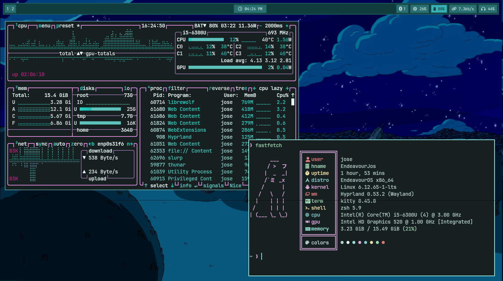
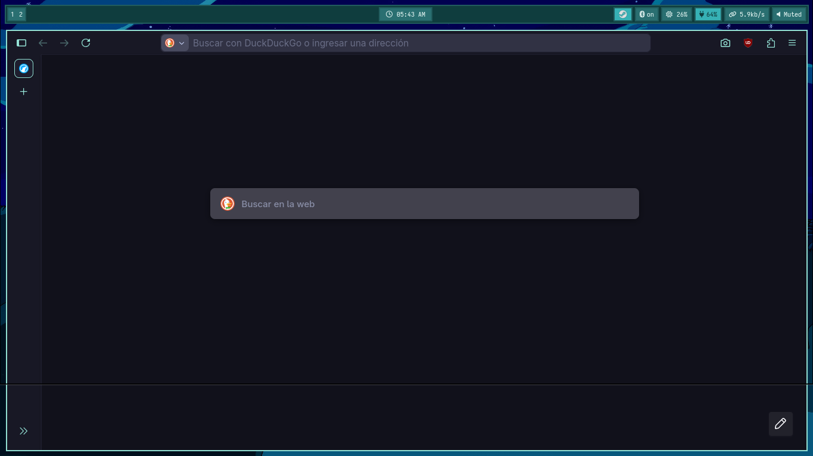

# HyprJos-Dots
Setup Hyprland, simple y funcional.

## Dependencias requeridas

- PipeWire (alsa, pulse, jack)
- wireplumber
- pavucontrol
- power-profiles-daemon
- auto-cpufreq
- networkmanager + applet
- nm-connection-editor
- netctl
- hyprland, hypridle, hyprlock, hyprpaper
- waybar, wofi, kitty
- thunar, mousepad
- nwg-look, mate-polkit
- wlogout, swaync

## Terminal

Zsh con configuración personalizada:

- zsh
- oh-my-zsh

Plugins:

- zsh-autosuggestions
- zsh-syntax-highlighting
- fzf-tab

Tema:

- powerlevel10k

Archivos incluidos:

- .zshrc
- .p10k.zsh

## CLI

- neovim, fzf, zoxide
- fastfetch, btop
- yay
- bat, lsd
- grim + slurp (screenshots)

## Fuentes

- JetBrainsMono Nerd Font
- IosevkaTerm Nerd Font
- OpenSans
- DejaVu
